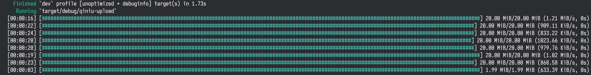

[](https://crates.io/crates/qiniu-uploader)
[](https://github.com/bujnlc8/qiniu-uploader/actions/workflows/qiniu-uploader.yml)

# 七牛文件上传

封装了七牛[直传文件](https://developer.qiniu.com/kodo/1312/upload)和[分片上传 v2 版](https://developer.qiniu.com/kodo/6364/multipartupload-interface)，支持显示上传进度条，由[indicatif](https://crates.io/crates/indicatif)提供支持.

分片上传的时候，支持设置分片大小和上传线程数量



## 使用

默认启用显示进度条

```
cargo add qiniu-uploader
```

也可以关闭显示进度条

```
cargo add qiniu-uploader --no-default-features
```

```rust

use mime::Mime;
use qiniu_uploader::{QiniuRegionEnum, QiniuUploader};
use tokio::fs;

#[tokio::main]
async fn main() -> Result<(), anyhow::Error> {
    let qiniu = QiniuUploader::new(
        "access_key",
        "secret_key",
        "bucket",
        Some(QiniuRegionEnum::Z0),
        false,
    );
    let file = fs::File::open("./Cargo.lock").await?;
    let file_size = file.metadata().await?.len() as usize;
    // 分片上传，支持设置分片大小或上传线程数量
    qiniu
        .clone()
        .part_upload_file(
            "test/Cargo.lock",
            file,
            file_size,
            Some(1024 * 1024 * 50), // 分片大小
            Some(10),               // 上传线程数量
            None,                   // 进度条样式
        )
        .await?;
    // 直传，文件大小应在1GB以内为宜
    let file = fs::File::open("./Cargo.lock").await?;
    qiniu
        .upload_file(
            "test/Cargo.lock.1",
            file,
            mime::APPLICATION_OCTET_STREAM,
            file_size,
            None,
        )
        .await?;
    Ok(())
}
```

更详细的参数见[https://docs.rs/qiniu-uploader/](https://docs.rs/qiniu-uploader/)
